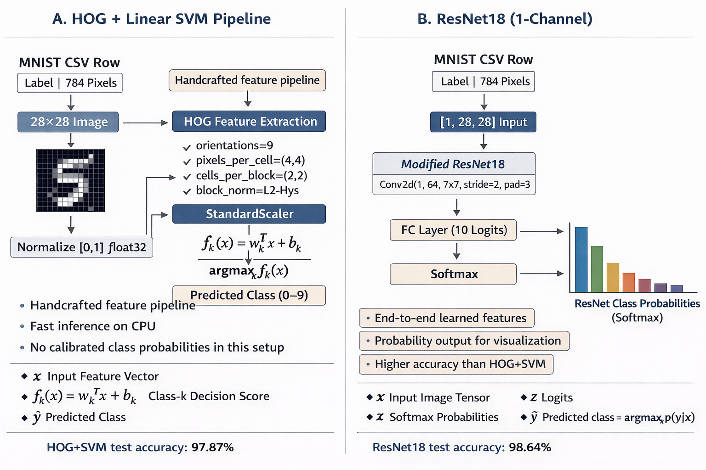

# mnist-hog-svm-vs-resnet

Train and compare two MNIST classifiers from CSV files:
- HOG + SVM (digit prediction only)
- ResNet18 (10-class softmax probabilities)

The project also includes a `pygame` demo that lets you draw digits and run unified inference from both models with throttled updates.

## Model Comparison Diagram

<p align="center">
  
</p>

## Dataset Format

Expected files:
- `data/mnist_train.csv` (60,000 rows)
- `data/mnist_test.csv` (10,000 rows)

Each row: 785 values, first label 0鈥?, remaining 784 pixels 0鈥?55.

## Setup

```bash
python -m venv .venv
# Windows
.venv\Scripts\activate
# Linux/macOS
source .venv/bin/activate

pip install -r requirements.txt
```

## Training Commands

Train HOG + SVM:
```bash
python -m src.train_hog_svm
```

Train ResNet:
```bash
python -m src.train_resnet
```

Run demo:
```bash
python -m src.demo
```


## Demo Video

<p align="center">
  <video src="docs/videos/demo.mp4" controls width="1100" preload="metadata"></video>
</p>

If inline playback is not available in your viewer, download/watch directly: [Demo Video](docs/videos/demo.mp4)

## Demo Controls

- Left mouse: draw
- `R`: reset canvas and outputs
- `ESC`: quit

## Outputs

- Models:
  - `models/hog_svm.joblib`
  - `models/resnet.pt`
- Reports:
  - `reports/metrics.json`
  - `reports/confusion_svm.png`
  - `reports/confusion_resnet.png`
  - `reports/training_curves.png`


